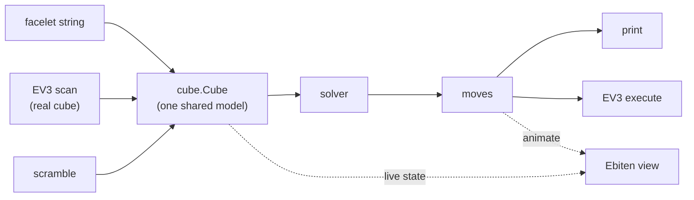

# rubix

A Rubik's cube solver in Go. The cube lives as plain data in a headless core; the
same state can be solved nine different ways, watched in an optional visualizer, and
driven on a real LEGO Mindstorms EV3 robot.

It is a port and extension of two "Coding Adventure" videos by Sebastian Lague, and
follows their *iterative* story — each solver is a step in making the previous one
better (and, like in the videos, the early ones don't always succeed):

- **Solving the Rubik's Cube** — https://www.youtube.com/watch?v=fy0HRViXZnE
- **I Tried Optimizing my Rubik's Cube Solver** — https://www.youtube.com/watch?v=Eysf6-E3ino

## Quick start

Requires Go 1.26+.

```sh
# list the solvers, in the order the videos introduce them
go run ./cmd/rubix solvers

# make a scramble and print its 54-sticker facelet string
go run ./cmd/rubix scramble -n 25 -seed 1

# solve a facelet string (URFDLB scheme); --strategy picks the solver
go run ./cmd/rubix solve --input <54-chars> --strategy multi

# pipe a scramble straight into a solve
go run ./cmd/rubix scramble -n 25 -seed 1 | awk '/facelets/{print $2}' \
  | xargs -I{} go run ./cmd/rubix solve --input {} --strategy prune

# print the robot move/primitive plan instead of driving hardware
go run ./cmd/rubix solve --input <54-chars> --strategy prune --execute
```

`verify` validates a facelet string, `scan` reads a cube from the robot, and
`gen-tables` precomputes the prune tables (cached under `$RUBIX_TABLES` or the user
cache dir).

## Watch it solve (visualizer)

The animated cube view is gated behind the `ebiten` build tag, so add `-tags ebiten`
to the `go run` command. It opens a window and plays the solution move by move:

```sh
# scramble a cube and watch it get solved in real time
go run -tags ebiten ./cmd/rubix view \
  --input "$(go run ./cmd/rubix scramble -n 25 -seed 1 | awk '/facelets/{print $2}')" \
  --strategy multi

# or attach the viewer to any solve
go run -tags ebiten ./cmd/rubix solve --input <54-chars> --strategy multi --view
```

Needs a desktop with OpenGL/X11 (it opens a real window, so not over plain SSH or in
a container). On Debian/Ubuntu install the dev libraries once:
`sudo apt install libgl1-mesa-dev libxrandr-dev libxcursor-dev libxinerama-dev libxi-dev`.
The first run pauses a few seconds to build the prune tables, then the window opens
and the status line counts the moves as the cube solves.

## The solvers

The cube is modelled at the cubie level (piece permutation + orientation), with edge
orientation toggled only by F/B quarter turns and corner orientation tracked by the
U/D-sticker face — exactly the conventions from the first video. Two engines back the
solvers: a **greedy-descent lookahead** (with a backward "meet in the middle"
dictionary) and a **domino two-phase** search.

| # | strategy | idea | solve rate¹ |
|---|----------|------|-------------|
| 1 | `greedy`   | hill-climb on solved-cubie count | ~10% (often stuck) |
| 2 | `sandwich` | greedy + backward-search dictionary | ~70% |
| 3 | `oriented` | orient all edges, then solve with F/B turns removed | ~99% |
| 4 | `cfop`     | Cross → F2L → OLL → PLL, staged | 100%, ~56 moves |
| 5 | `domino`   | reduce to the domino group, then solve it | ~95%, ~26 moves |
| 6 | `iddfs`    | domino search via iterative deepening | ~95% |
| 7 | `idastar`  | + a cheap admissible lower bound | ~98% |
| 8 | `prune`    | + exact prune tables (big speedup) | 100%, ~23 moves |
| 9 | `multi`    | try many reductions, keep the shortest | 100%, ~20 moves |

¹ Approximate, matching the videos. The early solvers are demonstrations of *why* the
later ones exist; `prune` and `multi` always solve. Run `DIAG=1 go test
./internal/solver -run TestDiagTiming` for live numbers.

## Architecture



Everything is the one `internal/cube` model. The visualizer and the robot are
optional front ends gated behind build tags so the default build is pure-Go and
dependency-light.

| build | command | adds |
|-------|---------|------|
| headless (default) | `go build ./...` | CLI + mock robot |
| with visualizer | `go build -tags ebiten ./...` | Ebiten cube view (needs a desktop with X11/OpenGL) |
| EV3 brick | `CGO_ENABLED=0 GOOS=linux GOARCH=arm GOARM=5 go build -tags ev3 -o rubix-ev3 ./cmd/rubix` | ev3dev motors + colour sensor |

`--view` (on `solve`) and the `view` command open the visualizer; `--execute` and the
`scan` command use the robot. Without the relevant tag both degrade gracefully (the
mock robot prints its plan; the visualizer prints a rebuild hint).

## References

The methods and tools this builds on:

- Two-phase / domino reduction — Herbert Kociemba: http://kociemba.org/cube.htm
- Thistlethwaite's algorithm: https://www.jaapsch.net/puzzles/thistle.htm
- CFOP (Cross, F2L, OLL, PLL): https://jperm.net/3x3/cfop
- IDA* and pattern databases — Richard Korf, "Finding Optimal Solutions to Rubik's
  Cube Using Pattern Databases": https://www.cs.princeton.edu/courses/archive/fall06/cos402/papers/korfrubik.pdf
- Cube notation: https://ruwix.com/the-rubiks-cube/notation/
- ev3dev (Debian for the EV3 brick): https://www.ev3dev.org/
- ev3go/ev3dev (Go bindings): https://github.com/ev3go/ev3dev
- MindCub3r (the LEGO solving robot this models): https://www.mindcuber.com/
- Ebiten (2D game library used for the visualizer): https://ebitengine.org/
