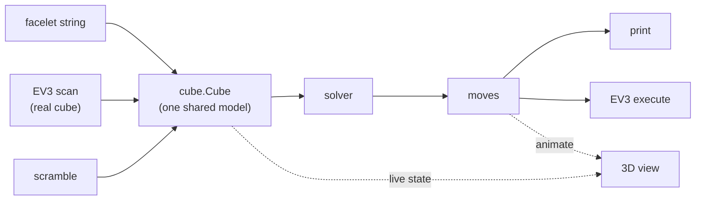

# rubix

A Rubik's cube solver in Go. The cube lives as plain data in a headless core, solved
nine different ways, with an optional 3D visualizer and a LEGO Mindstorms EV3 driver.

A port and extension of two "Coding Adventure" videos by Sebastian Lague:

- **Solving the Rubik's Cube** — https://www.youtube.com/watch?v=fy0HRViXZnE
- **I Tried Optimizing my Rubik's Cube Solver** — https://www.youtube.com/watch?v=Eysf6-E3ino

## Quick start

Requires Go 1.26+.

```sh
go run ./cmd/rubix solvers                       # list the solvers
go run ./cmd/rubix scramble -n 25 -seed 1        # a scramble + its facelet string
go run ./cmd/rubix solve --input <54-chars> --strategy multi
```

`--execute` prints the robot move/primitive plan; `verify`, `scan` and `gen-tables`
are the other subcommands.

## Watch it solve

The 3D visualizer is behind the `ebiten` build tag:

```sh
go run -tags ebiten ./cmd/rubix view \
  --input "$(go run ./cmd/rubix scramble -n 25 -seed 1 | awk '/facelets/{print $2}')" \
  --strategy multi
```

Controls: **drag / arrows** orbit · **space** unfold to a flat net · **x** x-ray ·
**r** new scramble. Needs a desktop with OpenGL/X11 (on Debian/Ubuntu:
`sudo apt install libgl1-mesa-dev libxrandr-dev libxcursor-dev libxinerama-dev libxi-dev`).

## The solvers

The nine solvers retrace the two videos' progression (rates are approximate):

| # | strategy | idea | solve rate |
|---|----------|------|------------|
| 1 | `greedy`   | hill-climb on solved-cubie count | ~10% (often stuck) |
| 2 | `sandwich` | greedy + backward-search dictionary | ~70% |
| 3 | `oriented` | orient all edges, then solve with F/B turns removed | ~99% |
| 4 | `cfop`     | Cross → F2L → OLL → PLL, staged | 100%, ~56 moves |
| 5 | `domino`   | reduce to the domino group, then solve it | ~95%, ~26 moves |
| 6 | `iddfs`    | domino search via iterative deepening | ~95% |
| 7 | `idastar`  | + a cheap admissible lower bound | ~98% |
| 8 | `prune`    | + exact prune tables (big speedup) | 100%, ~23 moves |
| 9 | `multi`    | try many reductions, keep the shortest | 100%, ~20 moves |

## Architecture



The visualizer and robot are optional front ends gated behind build tags, so the
default build is pure-Go:

| build | command |
|-------|---------|
| headless (default) | `go build ./...` |
| with visualizer | `go build -tags ebiten ./...` |
| EV3 brick | `CGO_ENABLED=0 GOOS=linux GOARCH=arm GOARM=5 go build -tags ev3 -o rubix-ev3 ./cmd/rubix` |

## References

- Two-phase / domino reduction — Herbert Kociemba: http://kociemba.org/cube.htm
- Thistlethwaite's algorithm: https://www.jaapsch.net/puzzles/thistle.htm
- CFOP: https://jperm.net/3x3/cfop
- IDA* + pattern databases — Korf, *Finding Optimal Solutions to Rubik's Cube*:
  https://www.cs.princeton.edu/courses/archive/fall06/cos402/papers/korfrubik.pdf
- ev3dev: https://www.ev3dev.org/ · ev3go/ev3dev: https://github.com/ev3go/ev3dev
- MindCub3r: https://www.mindcuber.com/ · Ebiten: https://ebitengine.org/
