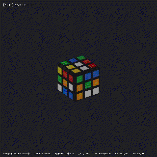
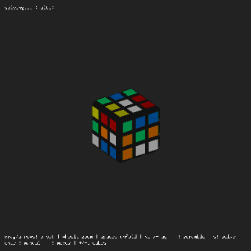
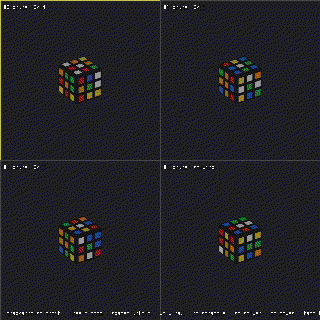

# Visualizer demos

A short animated GIF for each keybind in the 3D visualizer
(`go run -tags ebiten ./cmd/rubix view`). The visualizer is self-driving — it scrambles and
solves on its own — and these clips show what each key does on top of that.

Regenerate every GIF with [`just demos`](../justfile) (needs the `ebiten` build and a display;
each clip uses `--seed 1` so they reproduce). The recordings are produced by the visualizer's
own frame recorder via the `--record`, `--record-frames`, `--record-fps`, `--record-scale` and
`--record-keys` flags.

## `space` — unfold to a flat net
Morphs the cube between its solid 3D form and a flat unfolded net.

## `x` — x-ray
Hides the plastic body so every sticker (including the far sides) is visible at once.

## `r` — new scramble
Re-scrambles the cube and kicks off a fresh solve.

## `s` — switch solver
Cycles the focused cube to the next solver strategy and re-solves with it.

## `m` — toggle move list
Shows or hides the running list of solution moves.

## arrow keys — orbit
Orbits the camera around the cube (mouse drag does the same).

## `shift` + ↑/↓ — zoom
Zooms in and out (the scroll wheel does the same).

## `1` / `2` / `3` — switch layout, `tab` — focus next cube
`1` is the single self-driving cube, `2` is the compare grid (one scramble across every
solver), and `3` is the replica grid (several independent scrambles). In a grid, `tab`
moves the highlight to the next cube. The clip below presses `3` then cycles focus with
`tab`.

