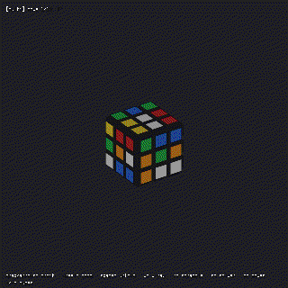

# Visualizer demos

A short animated GIF for each keybind in the 3D visualizer
(`go run -tags ebiten ./cmd/rubix view`). The visualizer is self-driving — it scrambles and
solves on its own — and these clips show what each key does on top of that.

Regenerate every GIF with [`just demos`](../justfile) (needs the `ebiten` build and a display;
each clip uses `--seed 1` so they reproduce). The recordings are produced by the visualizer's
own frame recorder via the `--record`, `--record-frames`, `--record-fps`, `--record-scale` and
`--record-keys` flags.

## `space` — unfold to a flat net
Morphs the cube between its solid 3D form and a flat unfolded net.

## `x` — x-ray
Hides the plastic body so every sticker (including the far sides) is visible at once.

## `r` — new scramble
Re-scrambles the cube and kicks off a fresh solve.

## `s` — switch solver
Cycles the focused cube to the next solver strategy and re-solves with it.

## `m` — toggle move list
Shows or hides the running list of solution moves.

## arrow keys — orbit
Orbits the camera around the cube (mouse drag does the same).

## `shift` + ↑/↓ — zoom
Zooms in and out (the scroll wheel does the same).

## `+` / `-` — open/close cube windows
Each cube gets its own window. Pressing `+` opens another cube window and `-` closes the
newest; the single window you launched is the "leader" and closing it closes them all. Every
window is a self-contained cube (its own scramble, change its solver with `s`), but the view
is **synchronised**: orbit, zoom (`shift`+↑/↓ or wheel), `x`-ray, `space` unfold and the `m`
move list all mirror across the windows, and `r` re-scrambles every window at once. So you can
fan out a row of windows, drive the camera from any one of them, and give each a different
solver to compare side by side.

Because the windows are separate OS processes, the built-in recorder (which captures one
window) can't film this — the clip below is a screen recording.

### Recording note
The single-window grid still exists for the GIF recorder (`just demos`): with `--record`,
`+`/`-` grow/shrink an in-window grid and `tab` focuses a cell (single-process, so the
per-keybind demos above stay reproducible). That recorded grid looks like this:

